# JBP Frontend

## 📋 Descripción del Proyecto

JBP Frontend es una aplicación web empresarial desarrollada con Angular 21 que gestiona múltiples módulos de negocio incluyendo ventas, bodega, farmacovigilancia, directorio telefónico y administración de usuarios. La aplicación utiliza una arquitectura basada en componentes standalone con Angular Material para la interfaz de usuario.

## 🏗️ Arquitectura del Proyecto
Component-Based Architecture con separación de capas

### Diagrama de Arquitectura

```mermaid
graph TB
    subgraph "Aplicación Angular"
        App[App Component]
        Router[Router]
    end

    subgraph "Capa Core"
        Guards[Guards<br/>auth.guard.ts<br/>no-auth.guard.ts]
        Services[Services<br/>user.service.ts<br/>url.service.ts]
        Models[Models<br/>loginMsg.ts<br/>common.msg.ts<br/>producto.msg.ts]
        Strategies[Strategies<br/>title.strategy.ts]
    end

    subgraph "Capa Features"
        Login[Login]
        Dashboard[Dashboard]
        Ventas[Ventas<br/>entregas-urbano<br/>hoja-ruta<br/>notas-credito]
        Bodega[Bodega<br/>generar-qr-ubicaciones<br/>consultar-ubicacion]
        Farmacovigilancia[Farmacovigilancia<br/>reacciones-reporte]
        Directorio[Directorio Telefónico]
        Usuarios[Usuarios<br/>registrar-usuario]
    end

    subgraph "Capa Shared"
        Alert[Alert System<br/>SweetAlertService]
        Header[Header Component]
        Sidebar[Sidebar Menu]
        Table[Table Component]
        Modal[Modal System]
        Loader[Loader Components]
        Validators[Validators]
        Utils[Utilities<br/>arrayUtils<br/>stringUtils<br/>dateUtils]
    end

    subgraph "Backend"
        API[REST API]
        SignalR[SignalR<br/>Real-time]
    end

    App --> Router
    Router --> Login
    Router --> Dashboard
    Router --> Ventas
    Router --> Bodega
    Router --> Farmacovigilancia
    Router --> Directorio
    Router --> Usuarios

    Login --> Guards
    Dashboard --> Guards
    Ventas --> Guards
    Bodega --> Guards
    Farmacovigilancia --> Guards
    Usuarios --> Guards

    Login --> Services
    Dashboard --> Services
    Ventas --> Services
    Bodega --> Services
    Farmacovigilancia --> Services
    Usuarios --> Services

    Ventas --> Models
    Bodega --> Models
    Farmacovigilancia --> Models
    Usuarios --> Models

    Dashboard --> Header
    Dashboard --> Sidebar
    Ventas --> Header
    Ventas --> Sidebar
    Bodega --> Header
    Bodega --> Sidebar
    Farmacovigilancia --> Header
    Farmacovigilancia --> Sidebar

    Ventas --> Table
    Bodega --> Table
    Farmacovigilancia --> Table

    Ventas --> Alert
    Bodega --> Alert
    Farmacovigilancia --> Alert
    Usuarios --> Alert

    Ventas --> Modal
    Bodega --> Modal
    Farmacovigilancia --> Modal

    Ventas --> Loader
    Bodega --> Loader
    Farmacovigilancia --> Loader

    Ventas --> Validators
    Usuarios --> Validators

    Ventas --> Utils
    Bodega --> Utils
    Farmacovigilancia --> Utils

    Services --> API
    Services --> SignalR

    style App fill:#e1f5ff
    style Core fill:#fff4e1
    style Features fill:#e8f5e9
    style Shared fill:#f3e5f5
    style Backend fill:#ffebee
```



### Estructura General

El proyecto sigue una arquitectura modular organizada en tres capas principales:

```
src/app/
├── core/              # Capa central (servicios, guards, modelos)
├── features/          # Capa de características (módulos de negocio)
├── shared/            # Capa compartida (componentes reutilizables)
├── assets/            # Recursos estáticos
└── app.ts             # Componente raíz
```

### 📦 Capas de la Arquitectura

#### 1. **Capa Core** (`src/app/core/`)

Contiene la lógica central y reutilizable de la aplicación:

- **Guards** (`guards/`): Protección de rutas y autenticación
  - `auth.guard.ts`: Guard para rutas protegidas (requiere autenticación)
  - `no-auth.guard.ts`: Guard para rutas públicas (login)

- **Services** (`services/`): Servicios globales
  - `user.service.ts`: Gestión de usuarios y autenticación
  - `url.service.ts`: Gestión de URLs de la API
  - `get-url-endpoint.service.ts`: Configuración de endpoints

- **Models** (`models/`): Modelos de datos compartidos
  - `loginMsg.ts`: Modelo de autenticación
  - `common.msg.ts`: Modelos comunes
  - `catalogo.msg.ts`: Modelos de catálogos
  - `directorioMsg.ts`: Modelos de directorio
  - `producto.msg.ts`: Modelos de productos
  - `socioNegocioMsg.ts`: Modelos de socios de negocio
  - `promotickMsg.ts`: Modelos de Promotick
  - `pedidos.msg.ts`: Modelos de pedidos
  - `estadoCuentaMsg.ts`: Modelos de estado de cuenta
  - `documentoEnviadoMsg.ts`: Modelos de documentos
  - `enums.msg.ts`: Enumeraciones del sistema
  - `alert.model.ts`: Modelo de alertas
  - `confMsg.ts`: Configuración del sistema
  - `tmpMsg.ts`: Modelos temporales

- **Strategies** (`strategies/`): Estrategias de Angular
  - `title.strategy.ts`: Estrategia de títulos de página

#### 2. **Capa Features** (`src/app/features/`)

Contiene los módulos de negocio específicos, cada uno con su propia lógica:

- **Ventas** (`ventas/`):
  - `update-num-factura-exportacion/`: Actualización de números de factura de exportación
  - `entregas-urbano/`: Gestión de entregas urbanas
  - `hoja-ruta/`: Hoja de ruta y reportes
  - `notas-credito/`: Gestión de notas de crédito
  - `historico-facturas/`: Histórico de facturas

- **Bodega** (`bodega/`):
  - `generar-qr-ubicaciones/`: Generación de QR para ubicaciones
  - `consultar-ubicacion/`: Consulta de ubicaciones

- **Dashboard** (`dashboard/`):
  - `dashboard/`: Panel principal de control
  - `dashboard-lista/`: Lista de dashboards
  - `dashboard-nuevo/`: Creación de nuevos dashboards

- **Otros Módulos**:
  - `login/`: Autenticación de usuarios
  - `directorio-telefonico/`: Directorio telefónico
  - `reacciones-reporte/`: Reporte de reacciones adversas (Farmacovigilancia)
  - `registrar-usuario/`: Registro de usuarios
  - `envio-retenciones/`: Envío de retenciones
  - `actualizar-monto-cuentas/`: Actualización de montos de cuentas
  - `controls/`: Controles de calidad
  - `error/`: Página de error

#### 3. **Capa Shared** (`src/app/shared/`)

Contiene componentes y utilidades reutilizables en toda la aplicación:

- **Componentes UI**:
  - `alert/`: Sistema de alertas personalizado (SweetAlertService)
  - `header/`: Encabezado de la aplicación
  - `side-bar-menu/`: Menú lateral de navegación
  - `button-loader/`: Botón con indicador de carga
  - `loader-page/`: Página de carga
  - `modal/`: Sistema de modales
  - `info-button/`: Botón de información
  - `table/`: Tabla reutilizable con paginación

- **Utilidades**:
  - `arrayUtils.ts`: Funciones de utilidad para arrays
  - `stringUtils.ts`: Funciones de utilidad para strings
  - `dateUtils.ts`: Funciones de utilidad para fechas
  - `catalog.utils.ts`: Utilidades de catálogos
  - `validators/`: Validadores personalizados (password.validator.ts)

- **Estilos**:
  - `styles/`: Estilos globales y variables SCSS

## 🔧 Tecnologías y Dependencias

### Framework Principal
- **Angular 21.2.0**: Framework principal
- **Angular Material 21.2.6**: Biblioteca de componentes UI
- **Angular CDK 21.2.6**: Componentes de desarrollo
- **TypeScript 5.9.2**: Lenguaje de programación

### Librerías Adicionales
- **RxJS 7.8.0**: Programación reactiva
- **@microsoft/signalr 10.0.0**: Comunicación en tiempo real
- **angularx-qrcode 21.0.5**: Generación de códigos QR
- **file-saver 2.0.5**: Descarga de archivos
- **ng-flex-layout 21.2.9**: Layout responsivo
- **ngx-print 21.2.0**: Funcionalidad de impresión
- **xlsx 0.18.5**: Manejo de archivos Excel

### Herramientas de Desarrollo
- **Angular CLI 21.2.7**: Herramienta de línea de comandos
- **Vitest 4.0.8**: Framework de pruebas
- **Prettier 3.8.1**: Formateador de código

## 🚀 Arquitectura de Componentes

### Componentes Standalone

El proyecto utiliza componentes standalone de Angular 21

## 🔐 Sistema de Autenticación y Autorización

### Guards de Ruta

- **AuthGuard**: Protege rutas que requieren autenticación
  - Verifica si existe el usuario en localStorage
  - Redirige al login si no está autenticado

- **NoAuthGuard**: Protege rutas públicas
  - Redirige al dashboard si ya está autenticado

### Gestión de Estado

- **LocalStorage**: Almacenamiento de sesión del usuario
- **Signals**: Estado reactivo de Angular 21
- **Services**: Inyección de dependencias para gestión de estado

## 🎨 Sistema de Diseño

### Angular Material

La aplicación utiliza Angular Material como biblioteca principal de componentes UI:

### Sistema de Colores

Variables SCSS personalizadas en `shared/styles/colors.scss`:
- Colores primarios y secundarios
- Gradientes
- Colores semánticos (éxito, error, advertencia)
- Colores de fondo y texto

## 📡 Comunicación con Backend

### Servicios HTTP

Los servicios de cada feature se comunican con el backend mediante:

- **HttpClient**: Para llamadas REST
- **Observable/RxJS**: Para manejo asíncrono
- **Interceptors**: Para manejo de errores y autenticación
- **SignalR**: Para comunicación en tiempo real

### Gestión de Errores

- **SweetAlertService**: Sistema de alertas personalizado
- **Try-Catch**: Manejo de excepciones
- **Error Pages**: Página de error personalizada

## 🛣️ Sistema de Rutas

### Estructura de Rutas

Las rutas están definidas en `app.routes.ts`:

```typescript
export const routes: Routes = [
  { path: '', component: Login, canActivate: [noAuthGuard] },
  { path: 'dashboard', component: Dashboard, canActivate: [AuthGuard] },
  { path: 'ventas/*', component: VentasComponent, canActivate: [AuthGuard] },
  // ... más rutas
  { path: '**', component: Error }
]
```

### Lazy Loading

Los componentes se cargan bajo demanda para optimizar el rendimiento.

## 📱 Responsividad

### Breakpoints

- **Desktop**: > 1200px
- **Tablet**: 768px - 1200px
- **Mobile**: < 768px

### Sidebar Adaptativo

- **Desktop**: Sidebar fijo a la izquierda
- **Mobile**: Sidebar desplegable con overlay

## 🔧 Scripts Disponibles

```bash
# Iniciar servidor de desarrollo
npm start

# Compilar para producción
npm run build

# Compilar en modo watch
npm run watch

# Ejecutar pruebas
npm test
```

## 📁 Estructura de Directorios Detallada

```
jbpFrontEnd/
├── src/
│   ├── app/
│   │   ├── core/                 # Capa central
│   │   │   ├── guards/          # Guards de ruta
│   │   │   ├── services/        # Servicios globales
│   │   │   ├── models/          # Modelos de datos
│   │   │   ├── strategies/      # Estrategias Angular
│   │   │   ├── interceptors/    # Interceptors HTTP
│   │   │   └── resolvers/       # Resolvers de ruta
│   │   ├── features/            # Capa de características
│   │   │   ├── login/           # Autenticación
│   │   │   ├── dashboard/       # Dashboard
│   │   │   ├── ventas/          # Módulo de ventas
│   │   │   ├── bodega/          # Módulo de bodega
│   │   │   ├── reacciones-reporte/ # Farmacovigilancia
│   │   │   └── ...              # Otros módulos
│   │   ├── shared/              # Capa compartida
│   │   │   ├── alert/           # Sistema de alertas
│   │   │   ├── header/          # Encabezado
│   │   │   ├── side-bar-menu/   # Menú lateral
│   │   │   ├── table/           # Tabla reutilizable
│   │   │   ├── modal/           # Sistema de modales
│   │   │   ├── button-loader/   # Botón con loader
│   │   │   ├── loader-page/     # Página de carga
│   │   │   ├── validators/      # Validadores
│   │   │   └── styles/          # Estilos globales
│   │   ├── assets/              # Recursos estáticos
│   │   │   ├── data/            # Datos estáticos
│   │   │   └── enviroment.ts    # Configuración de entorno
│   │   ├── app.ts               # Componente raíz
│   │   ├── app.html             # Template raíz
│   │   ├── app.scss             # Estilos globales
│   │   ├── app.routes.ts        # Configuración de rutas
│   │   └── app.config.ts        # Configuración de Angular
│   └── index.html               # HTML principal
├── package.json                 # Dependencias
├── tsconfig.json                # Configuración TypeScript
├── angular.json                 # Configuración Angular CLI
└── README.md                    # Este archivo
```

## 🎯 Patrones de Diseño Utilizados

### 1. **Single Responsibility Principle**
- Cada componente tiene una responsabilidad única
- Servicios separados por funcionalidad

### 2. **Dependency Injection**
- Inyección de dependencias mediante `inject()`
- Servicios proporcionados en `root`

### 3. **Observer Pattern**
- RxJS para manejo de streams de datos
- Signals para estado reactivo

### 4. **Component Composition**
- Componentes pequeños y reutilizables
- Composición de componentes complejos

### 5. **Service Layer Pattern**
- Lógica de negocio en servicios
- Componentes solo para presentación

## 🔒 Seguridad

### Autenticación
- Validación de usuario en localStorage
- Guards de ruta para protección
- Tokens de sesión

### Autorización
- Control de acceso por módulos
- Verificación de perfiles de usuario
- Permisos basados en roles

## 📄 Licencia

Propiedad de JBP. Todos los derechos reservados.
